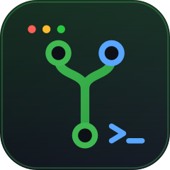
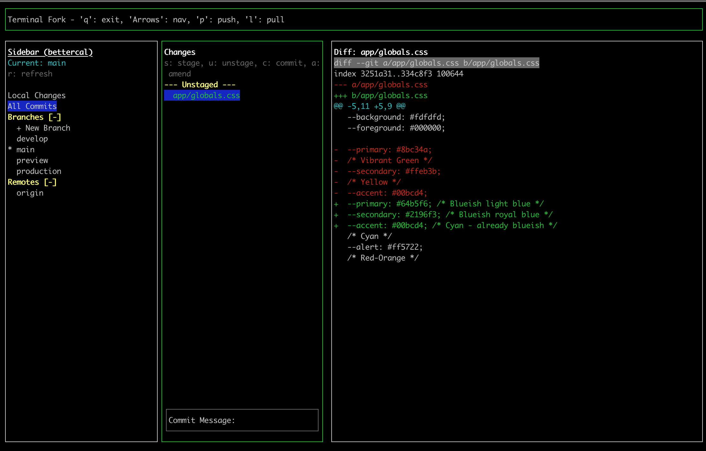

<div align="center">
  

  # git-tork

  **A keyboard-first Git client for your terminal — with mouse support.**

  [](https://www.npmjs.com/package/git-tork)
  [](LICENSE)
  [](package.json)

  [Website](https://git-tork.sijin.tv) · [Report a Bug](https://github.com/sijintv/git-tork/issues) · [npm](https://www.npmjs.com/package/git-tork)
</div>

---

<!-- TODO: replace with a real screenshot: run `git-tork` in a repo and capture your terminal -->


## Why git-tork?

Staging, committing, branching, and reading diffs shouldn't require leaving your terminal — or memorizing twenty git flags. `git-tork` gives you a fast, focused TUI:

- **Zero install** — run it with `npx`
- **Keyboard-first** — every action is a keystroke away
- **Mouse support** — click panes, rows, and sections when you feel like it
- **Runs anywhere** — any terminal with a Node.js ≥ 18 runtime

## Quick Start

```bash
# Run instantly
npx git-tork

# Or install globally
npm install -g git-tork
git-tork

# Point it at any repo
git-tork /path/to/repo
```

## Features

- **Commit graph** — colorized `git log --graph` across all branches, scrollable
- **Changes view** — stage/unstage files, write commit messages, amend the last commit
- **Diff viewer** — per-file diffs with syntax-highlighted `+` / `-` / `@@` lines
- **Branch management** — checkout, create branches, browse remotes from the sidebar
- **Push & pull** — one keypress, with live status feedback in the header
- **Mouse support** — click to focus panes and select list rows
- **Alternate screen buffer** — your terminal scrollback stays clean

## Keybindings

### Global

| Key | Action |
| --- | --- |
| `↑` / `↓` | Navigate lists |
| `←` / `→` | Move focus between panes (Sidebar ↔ Commits, or Sidebar ↔ Status ↔ Diff) |
| `p` | Push |
| `l` | Pull |
| `q` / `Ctrl+C` | Quit |

### Sidebar

| Key | Action |
| --- | --- |
| `Enter` | Checkout branch / open view / toggle section |
| `Space` | Collapse or expand a section |
| `r` | Refresh branches and remotes |
| `Enter` on `+ New Branch` | Create a new branch |

### Changes View

| Key | Action |
| --- | --- |
| `s` | Stage highlighted file |
| `u` | Unstage highlighted file |
| `c` | Focus the commit message input |
| `a` | Toggle amend (pre-fills last commit message) |
| `Enter` | Show diff for highlighted file / submit commit |
| `Esc` | Cancel text input |

## Development

```bash
git clone https://github.com/sijintv/git-tork.git
cd git-tork
npm install
npm run dev        # run from source with tsx
npm run build      # compile to dist/
```

Built with [React](https://react.dev), [Ink](https://github.com/vadimdemedes/ink), and [simple-git](https://github.com/steveukx/git-js).

## Contributing

Issues and PRs are welcome. If you hit a bug, please include your terminal emulator, OS, and Node version.

## License

[MIT](LICENSE) © Sijin T V
